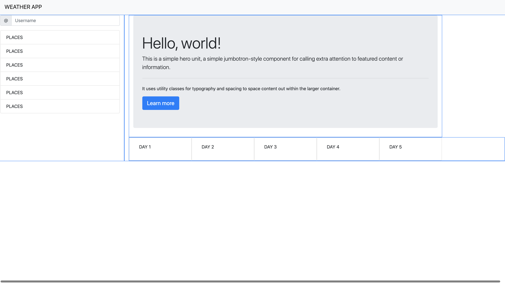

# hw6-weather_app


### Functionality 
 - Ability to search for a city
   - current and future conditions
     - ELEMENTS to RETURN
       -  city name, 
       -  the date, 
       -  an icon representation of weather conditions, 
       -  the temperature, 
       -  the humidity, 
       -  the wind speed, 
       -  and the UV index
    -  Each element shoudl be color coded 
       -   favorable, 
       -   moderate, 
       -   or severe
   - save city to the a search history
     - presented with current and future conditions for that city
   - Display 5 day forcast
     - displays the date, 
     - an icon representation of weather conditions, 
     - the temperature, 
     - and the humidity
   - on open
     - present last searched city forecast

*use moment.js for current date and time formating*
---

**LAYOUT**




### API SECTION


**Current forcast by city URL**
>https://api.openweathermap.org/data/2.5/weather?q={CITY}&units=imperial&appid={API_KEY}


*q city name, state code and country code divided by comma, use ISO 3166 country codes. You can specify the parameter not only in English. In this case, the API response should be returned in the same language as the language of requested location name if the location is in our predefined list of more than 200,000 locations.*


**JSON RESULT**
```
{
    "base": "stations",
    "clouds": {
        "all": 4
    },
    "cod": 200,
    "coord": {
        "lat": 30.24,
        "lon": -97.77
    },
    "dt": 1598147864,
    "id": 0,
    "main": {
        "feels_like": 81.9,
        "humidity": 70,
        "pressure": 1009,
        "temp": 79.88,
        "temp_max": 82,
        "temp_min": 75.99
    },
    "name": "Austin",
    "sys": {
        "country": "US",
        "id": 2016722,
        "sunrise": 1598097764,
        "sunset": 1598144718,
        "type": 3
    },
    "timezone": -18000,
    "visibility": 10000,
    "weather": [
        {
            "description": "clear sky",
            "icon": "01n",
            "id": 800,
            "main": "Clear"
        }
    ],
    "wind": {
        "deg": 164,
        "speed": 9.26
    }
}

```

**5 day forcast by city URL**

*You can search weather forecast for 5 days with data every 3 hours by city name. All weather data can be obtained in JSON and XML formats.*


>https://api.openweathermap.org/data/2.5/forecast?q={CITY}&appid={API_KEY}
```
{
    "city": {
        "coord": {
            "lat": 30.2672,
            "lon": -97.7431
        },
        "country": "US",
        "id": 4671654,
        "name": "Austin",
        "population": 790390,
        "sunrise": 1598097755,
        "sunset": 1598144713,
        "timezone": -18000
    },
    "cnt": 40,
    "cod": "200",
    "list": [
        {
            "clouds": {
                "all": 0
            },
            "dt": 1598151600,
            "dt_txt": "2020-08-23 03:00:00",
            "main": {
                "feels_like": 300.14,
                "grnd_level": 994,
                "humidity": 51,
                "pressure": 1009,
                "sea_level": 1012,
                "temp": 300.71,
                "temp_kf": -0.82,
                "temp_max": 301.53,
                "temp_min": 300.71
            },
            "pop": 0,
            "sys": {
                "pod": "n"
            },
            "visibility": 10000,
            "weather": [
                {
                    "description": "clear sky",
                    "icon": "01n",
                    "id": 800,
                    "main": "Clear"
                }
            ],
            "wind": {
                "deg": 167,
                "speed": 3.93
            }
        },
        {
            "clouds": {
                "all": 0
            },
            "dt": 1598162400,
            "dt_txt": "2020-08-23 06:00:00",
            "main": {
                "feels_like": 299.14,
                "grnd_level": 995,
                "humidity": 51,
                "pressure": 1011,
                "sea_level": 1013,
                "temp": 299.66,
                "temp_kf": 0.07,
                "temp_max": 299.66,
                "temp_min": 299.59
            },
            "pop": 0,
            "sys": {
                "pod": "n"
            },
            "visibility": 10000,
            "weather": [
                {
                    "description": "clear sky",
                    "icon": "01n",
                    "id": 800,
                    "main": "Clear"
                }
            ],
            "wind": {
                "deg": 175,
                "speed": 3.33
            }
        },
        {
            "clouds": {
                "all": 0
            },
            "dt": 1598173200,
            "dt_txt": "2020-08-23 09:00:00",
            "main": {
                "feels_like": 299.52,
                "grnd_level": 995,
                "humidity": 62,
                "pressure": 1013,
                "sea_level": 1013,
                "temp": 298.6,
                "temp_kf": 0.09,
                "temp_max": 298.6,
                "temp_min": 298.51
            },
            "pop": 0,
            "sys": {
                "pod": "n"
            },
            "visibility": 10000,
            "weather": [
                {
                    "description": "clear sky",
                    "icon": "01n",
                    "id": 800,
                    "main": "Clear"
                }
            ],
            "wind": {
                "deg": 209,
                "speed": 2.45
            }
        },
        {
            "clouds": {
                "all": 0
            },
            "dt": 1598184000,
            "dt_txt": "2020-08-23 12:00:00",
            "main": {
                "feels_like": 300.08,
                "grnd_level": 996,
                "humidity": 66,
                "pressure": 1014,
                "sea_level": 1014,
                "temp": 298.06,
                "temp_kf": 0.02,
                "temp_max": 298.06,
                "temp_min": 298.04
            },
            "pop": 0,
            "sys": {
                "pod": "n"
            },
            "visibility": 10000,
            "weather": [
                {
                    "description": "clear sky",
                    "icon": "01n",
                    "id": 800,
                    "main": "Clear"
                }
            ],
            "wind": {
                "deg": 231,
                "speed": 1.17
            }
        },
        {
            "clouds": {
                "all": 0
            },
            "dt": 1598194800,
            "dt_txt": "2020-08-23 15:00:00",
            "main": {
                "feels_like": 304.95,
                "grnd_level": 997,
                "humidity": 46,
                "pressure": 1015,
                "sea_level": 1015,
                "temp": 303.06,
                "temp_kf": 0,
                "temp_max": 303.06,
                "temp_min": 303.06
            },
            "pop": 0,
            "sys": {
                "pod": "d"
            },
            "visibility": 10000,
            "weather": [
                {
                    "description": "clear sky",
                    "icon": "01d",
                    "id": 800,
                    "main": "Clear"
                }
            ],
            "wind": {
                "deg": 340,
                "speed": 0.71
            }
        },
        {
            "clouds": {
                "all": 0
            },
            "dt": 1598205600,
            "dt_txt": "2020-08-23 18:00:00",
            "main": {
                "feels_like": 306.92,
                "grnd_level": 996,
                "humidity": 33,
                "pressure": 1014,
                "sea_level": 1014,
                "temp": 307.03,
                "temp_kf": 0,
                "temp_max": 307.03,
                "temp_min": 307.03
            },
            "pop": 0,
            "sys": {
                "pod": "d"
            },
            "visibility": 10000,
            "weather": [
                {
                    "description": "clear sky",
                    "icon": "01d",
                    "id": 800,
                    "main": "Clear"
                }
            ],
            "wind": {
                "deg": 78,
                "speed": 2.64
            }
        },
        {
            "clouds": {
                "all": 83
            },
            "dt": 1598216400,
            "dt_txt": "2020-08-23 21:00:00",
            "main": {
                "feels_like": 306.69,
                "grnd_level": 995,
                "humidity": 30,
                "pressure": 1012,
                "sea_level": 1012,
                "temp": 307.57,
                "temp_kf": 0,
                "temp_max": 307.57,
                "temp_min": 307.57
            },
            "pop": 0,
            "sys": {
                "pod": "d"
            },
            "visibility": 10000,
            "weather": [
                {
                    "description": "broken clouds",
                    "icon": "04d",
                    "id": 803,
                    "main": "Clouds"
                }
            ],
            "wind": {
                "deg": 90,
                "speed": 3.22
            }
        },
        {
            "clouds": {
                "all": 78
            },
            "dt": 1598227200,
            "dt_txt": "2020-08-24 00:00:00",
            "main": {
                "feels_like": 305.17,
                "grnd_level": 994,
                "humidity": 34,
                "pressure": 1012,
                "sea_level": 1012,
                "temp": 306.27,
                "temp_kf": 0,
                "temp_max": 306.27,
                "temp_min": 306.27
            },
            "pop": 0,
            "sys": {
                "pod": "d"
            },
            "visibility": 10000,
            "weather": [
                {
                    "description": "broken clouds",
                    "icon": "04d",
                    "id": 803,
                    "main": "Clouds"
                }
            ],
            "wind": {
                "deg": 86,
                "speed": 3.95
            }
        },
        {
            "clouds": {
                "all": 91
            },
            "dt": 1598238000,
            "dt_txt": "2020-08-24 03:00:00",
            "main": {
                "feels_like": 304.66,
                "grnd_level": 996,
                "humidity": 40,
                "pressure": 1014,
                "sea_level": 1014,
                "temp": 303.95,
                "temp_kf": 0,
                "temp_max": 303.95,
                "temp_min": 303.95
            },
            "pop": 0,
            "sys": {
                "pod": "n"
            },
            "visibility": 10000,
            "weather": [
                {
                    "description": "overcast clouds",
                    "icon": "04n",
                    "id": 804,
                    "main": "Clouds"
                }
            ],
            "wind": {
                "deg": 99,
                "speed": 1.62
            }
        },
        {
            "clouds": {
                "all": 86
            },
            "dt": 1598248800,
            "dt_txt": "2020-08-24 06:00:00",
            "main": {
                "feels_like": 302.46,
                "grnd_level": 996,
                "humidity": 48,
                "pressure": 1014,
                "sea_level": 1014,
                "temp": 301.84,
                "temp_kf": 0,
                "temp_max": 301.84,
                "temp_min": 301.84
            },
            "pop": 0,
            "sys": {
                "pod": "n"
            },
            "visibility": 10000,
            "weather": [
                {
                    "description": "overcast clouds",
                    "icon": "04n",
                    "id": 804,
                    "main": "Clouds"
                }
            ],
            "wind": {
                "deg": 183,
                "speed": 2.27
            }
        },
        {
            "clouds": {
                "all": 39
            },
            "dt": 1598259600,
            "dt_txt": "2020-08-24 09:00:00",
            "main": {
                "feels_like": 301.06,
                "grnd_level": 996,
                "humidity": 57,
                "pressure": 1014,
                "sea_level": 1014,
                "temp": 300.31,
                "temp_kf": 0,
                "temp_max": 300.31,
                "temp_min": 300.31
            },
            "pop": 0,
            "sys": {
                "pod": "n"
            },
            "visibility": 10000,
            "weather": [
                {
                    "description": "scattered clouds",
                    "icon": "03n",
                    "id": 802,
                    "main": "Clouds"
                }
            ],
            "wind": {
                "deg": 206,
                "speed": 2.86
            }
        },
        {
            "clouds": {
                "all": 27
            },
            "dt": 1598270400,
            "dt_txt": "2020-08-24 12:00:00",
            "main": {
                "feels_like": 301.64,
                "grnd_level": 997,
                "humidity": 60,
                "pressure": 1014,
                "sea_level": 1014,
                "temp": 299.79,
                "temp_kf": 0,
                "temp_max": 299.79,
                "temp_min": 299.79
            },
            "pop": 0,
            "sys": {
                "pod": "n"
            },
            "visibility": 10000,
            "weather": [
                {
                    "description": "scattered clouds",
                    "icon": "03n",
                    "id": 802,
                    "main": "Clouds"
                }
            ],
            "wind": {
                "deg": 262,
                "speed": 1.48
            }
        },
        {
            "clouds": {
                "all": 0
            },
            "dt": 1598281200,
            "dt_txt": "2020-08-24 15:00:00",
            "main": {
                "feels_like": 305.34,
                "grnd_level": 997,
                "humidity": 44,
                "pressure": 1015,
                "sea_level": 1015,
                "temp": 304.14,
                "temp_kf": 0,
                "temp_max": 304.14,
                "temp_min": 304.14
            },
            "pop": 0,
            "sys": {
                "pod": "d"
            },
            "visibility": 10000,
            "weather": [
                {
                    "description": "clear sky",
                    "icon": "01d",
                    "id": 800,
                    "main": "Clear"
                }
            ],
            "wind": {
                "deg": 6,
                "speed": 1.86
            }
        },
        {
            "clouds": {
                "all": 6
            },
            "dt": 1598292000,
            "dt_txt": "2020-08-24 18:00:00",
            "main": {
                "feels_like": 307.1,
                "grnd_level": 997,
                "humidity": 30,
                "pressure": 1014,
                "sea_level": 1014,
                "temp": 308.03,
                "temp_kf": 0,
                "temp_max": 308.03,
                "temp_min": 308.03
            },
            "pop": 0,
            "sys": {
                "pod": "d"
            },
            "visibility": 10000,
            "weather": [
                {
                    "description": "clear sky",
                    "icon": "01d",
                    "id": 800,
                    "main": "Clear"
                }
            ],
            "wind": {
                "deg": 56,
                "speed": 3.49
            }
        },
        {
            "clouds": {
                "all": 65
            },
            "dt": 1598302800,
            "dt_txt": "2020-08-24 21:00:00",
            "main": {
                "feels_like": 309.52,
                "grnd_level": 995,
                "humidity": 23,
                "pressure": 1012,
                "sea_level": 1012,
                "temp": 310.16,
                "temp_kf": 0,
                "temp_max": 310.16,
                "temp_min": 310.16
            },
            "pop": 0,
            "sys": {
                "pod": "d"
            },
            "visibility": 10000,
            "weather": [
                {
                    "description": "broken clouds",
                    "icon": "04d",
                    "id": 803,
                    "main": "Clouds"
                }
            ],
            "wind": {
                "deg": 61,
                "speed": 1.98
            }
        },
        {
            "clouds": {
                "all": 64
            },
            "dt": 1598313600,
            "dt_txt": "2020-08-25 00:00:00",
            "main": {
                "feels_like": 306.34,
                "grnd_level": 993,
                "humidity": 23,
                "pressure": 1011,
                "sea_level": 1011,
                "temp": 308.84,
                "temp_kf": 0,
                "temp_max": 308.84,
                "temp_min": 308.84
            },
            "pop": 0,
            "sys": {
                "pod": "d"
            },
            "visibility": 10000,
            "weather": [
                {
                    "description": "broken clouds",
                    "icon": "04d",
                    "id": 803,
                    "main": "Clouds"
                }
            ],
            "wind": {
                "deg": 107,
                "speed": 4.16
            }
        },
        {
            "clouds": {
                "all": 12
            },
            "dt": 1598324400,
            "dt_txt": "2020-08-25 03:00:00",
            "main": {
                "feels_like": 302.95,
                "grnd_level": 995,
                "humidity": 33,
                "pressure": 1012,
                "sea_level": 1012,
                "temp": 304.36,
                "temp_kf": 0,
                "temp_max": 304.36,
                "temp_min": 304.36
            },
            "pop": 0,
            "sys": {
                "pod": "n"
            },
            "visibility": 10000,
            "weather": [
                {
                    "description": "few clouds",
                    "icon": "02n",
                    "id": 801,
                    "main": "Clouds"
                }
            ],
            "wind": {
                "deg": 118,
                "speed": 3.35
            }
        },
        {
            "clouds": {
                "all": 6
            },
            "dt": 1598335200,
            "dt_txt": "2020-08-25 06:00:00",
            "main": {
                "feels_like": 302.98,
                "grnd_level": 996,
                "humidity": 41,
                "pressure": 1013,
                "sea_level": 1013,
                "temp": 302.65,
                "temp_kf": 0,
                "temp_max": 302.65,
                "temp_min": 302.65
            },
            "pop": 0,
            "sys": {
                "pod": "n"
            },
            "visibility": 10000,
            "weather": [
                {
                    "description": "clear sky",
                    "icon": "01n",
                    "id": 800,
                    "main": "Clear"
                }
            ],
            "wind": {
                "deg": 107,
                "speed": 1.75
            }
        },
        {
            "clouds": {
                "all": 0
            },
            "dt": 1598346000,
            "dt_txt": "2020-08-25 09:00:00",
            "main": {
                "feels_like": 302.14,
                "grnd_level": 995,
                "humidity": 45,
                "pressure": 1013,
                "sea_level": 1013,
                "temp": 301.54,
                "temp_kf": 0,
                "temp_max": 301.54,
                "temp_min": 301.54
            },
            "pop": 0,
            "sys": {
                "pod": "n"
            },
            "visibility": 10000,
            "weather": [
                {
                    "description": "clear sky",
                    "icon": "01n",
                    "id": 800,
                    "main": "Clear"
                }
            ],
            "wind": {
                "deg": 41,
                "speed": 1.6
            }
        },
        {
            "clouds": {
                "all": 0
            },
            "dt": 1598356800,
            "dt_txt": "2020-08-25 12:00:00",
            "main": {
                "feels_like": 300.77,
                "grnd_level": 996,
                "humidity": 55,
                "pressure": 1013,
                "sea_level": 1013,
                "temp": 300.2,
                "temp_kf": 0,
                "temp_max": 300.2,
                "temp_min": 300.2
            },
            "pop": 0,
            "sys": {
                "pod": "n"
            },
            "visibility": 10000,
            "weather": [
                {
                    "description": "clear sky",
                    "icon": "01n",
                    "id": 800,
                    "main": "Clear"
                }
            ],
            "wind": {
                "deg": 42,
                "speed": 2.72
            }
        },
        {
            "clouds": {
                "all": 0
            },
            "dt": 1598367600,
            "dt_txt": "2020-08-25 15:00:00",
            "main": {
                "feels_like": 304.94,
                "grnd_level": 996,
                "humidity": 52,
                "pressure": 1014,
                "sea_level": 1014,
                "temp": 303.61,
                "temp_kf": 0,
                "temp_max": 303.61,
                "temp_min": 303.61
            },
            "pop": 0,
            "sys": {
                "pod": "d"
            },
            "visibility": 10000,
            "weather": [
                {
                    "description": "clear sky",
                    "icon": "01d",
                    "id": 800,
                    "main": "Clear"
                }
            ],
            "wind": {
                "deg": 55,
                "speed": 3.03
            }
        },
        {
            "clouds": {
                "all": 4
            },
            "dt": 1598378400,
            "dt_txt": "2020-08-25 18:00:00",
            "main": {
                "feels_like": 307.6,
                "grnd_level": 995,
                "humidity": 34,
                "pressure": 1012,
                "sea_level": 1012,
                "temp": 308.15,
                "temp_kf": 0,
                "temp_max": 308.15,
                "temp_min": 308.15
            },
            "pop": 0,
            "sys": {
                "pod": "d"
            },
            "visibility": 10000,
            "weather": [
                {
                    "description": "clear sky",
                    "icon": "01d",
                    "id": 800,
                    "main": "Clear"
                }
            ],
            "wind": {
                "deg": 29,
                "speed": 4.05
            }
        },
        {
            "clouds": {
                "all": 3
            },
            "dt": 1598389200,
            "dt_txt": "2020-08-25 21:00:00",
            "main": {
                "feels_like": 308.64,
                "grnd_level": 992,
                "humidity": 26,
                "pressure": 1010,
                "sea_level": 1010,
                "temp": 310.21,
                "temp_kf": 0,
                "temp_max": 310.21,
                "temp_min": 310.21
            },
            "pop": 0,
            "sys": {
                "pod": "d"
            },
            "visibility": 10000,
            "weather": [
                {
                    "description": "clear sky",
                    "icon": "01d",
                    "id": 800,
                    "main": "Clear"
                }
            ],
            "wind": {
                "deg": 15,
                "speed": 4.22
            }
        },
        {
            "clouds": {
                "all": 3
            },
            "dt": 1598400000,
            "dt_txt": "2020-08-26 00:00:00",
            "main": {
                "feels_like": 307.91,
                "grnd_level": 992,
                "humidity": 30,
                "pressure": 1009,
                "sea_level": 1009,
                "temp": 309.08,
                "temp_kf": 0,
                "temp_max": 309.08,
                "temp_min": 309.08
            },
            "pop": 0,
            "sys": {
                "pod": "d"
            },
            "visibility": 10000,
            "weather": [
                {
                    "description": "clear sky",
                    "icon": "01d",
                    "id": 800,
                    "main": "Clear"
                }
            ],
            "wind": {
                "deg": 44,
                "speed": 4.29
            }
        },
        {
            "clouds": {
                "all": 65
            },
            "dt": 1598410800,
            "dt_txt": "2020-08-26 03:00:00",
            "main": {
                "feels_like": 305.32,
                "grnd_level": 994,
                "humidity": 51,
                "pressure": 1011,
                "sea_level": 1011,
                "temp": 304.56,
                "temp_kf": 0,
                "temp_max": 304.56,
                "temp_min": 304.56
            },
            "pop": 0,
            "sys": {
                "pod": "n"
            },
            "visibility": 10000,
            "weather": [
                {
                    "description": "broken clouds",
                    "icon": "04n",
                    "id": 803,
                    "main": "Clouds"
                }
            ],
            "wind": {
                "deg": 81,
                "speed": 4.22
            }
        },
        {
            "clouds": {
                "all": 33
            },
            "dt": 1598421600,
            "dt_txt": "2020-08-26 06:00:00",
            "main": {
                "feels_like": 304.46,
                "grnd_level": 994,
                "humidity": 61,
                "pressure": 1011,
                "sea_level": 1011,
                "temp": 302.43,
                "temp_kf": 0,
                "temp_max": 302.43,
                "temp_min": 302.43
            },
            "pop": 0,
            "sys": {
                "pod": "n"
            },
            "visibility": 10000,
            "weather": [
                {
                    "description": "scattered clouds",
                    "icon": "03n",
                    "id": 802,
                    "main": "Clouds"
                }
            ],
            "wind": {
                "deg": 76,
                "speed": 3.06
            }
        },
        {
            "clouds": {
                "all": 0
            },
            "dt": 1598432400,
            "dt_txt": "2020-08-26 09:00:00",
            "main": {
                "feels_like": 303.94,
                "grnd_level": 992,
                "humidity": 68,
                "pressure": 1010,
                "sea_level": 1010,
                "temp": 301.04,
                "temp_kf": 0,
                "temp_max": 301.04,
                "temp_min": 301.04
            },
            "pop": 0,
            "sys": {
                "pod": "n"
            },
            "visibility": 10000,
            "weather": [
                {
                    "description": "clear sky",
                    "icon": "01n",
                    "id": 800,
                    "main": "Clear"
                }
            ],
            "wind": {
                "deg": 66,
                "speed": 2.15
            }
        },
        {
            "clouds": {
                "all": 0
            },
            "dt": 1598443200,
            "dt_txt": "2020-08-26 12:00:00",
            "main": {
                "feels_like": 303.34,
                "grnd_level": 993,
                "humidity": 72,
                "pressure": 1011,
                "sea_level": 1011,
                "temp": 300.23,
                "temp_kf": 0,
                "temp_max": 300.23,
                "temp_min": 300.23
            },
            "pop": 0,
            "sys": {
                "pod": "n"
            },
            "visibility": 10000,
            "weather": [
                {
                    "description": "clear sky",
                    "icon": "01n",
                    "id": 800,
                    "main": "Clear"
                }
            ],
            "wind": {
                "deg": 47,
                "speed": 1.97
            }
        },
        {
            "clouds": {
                "all": 0
            },
            "dt": 1598454000,
            "dt_txt": "2020-08-26 15:00:00",
            "main": {
                "feels_like": 305.56,
                "grnd_level": 993,
                "humidity": 59,
                "pressure": 1011,
                "sea_level": 1011,
                "temp": 303.36,
                "temp_kf": 0,
                "temp_max": 303.36,
                "temp_min": 303.36
            },
            "pop": 0,
            "sys": {
                "pod": "d"
            },
            "visibility": 10000,
            "weather": [
                {
                    "description": "clear sky",
                    "icon": "01d",
                    "id": 800,
                    "main": "Clear"
                }
            ],
            "wind": {
                "deg": 29,
                "speed": 3.05
            }
        },
        {
            "clouds": {
                "all": 17
            },
            "dt": 1598464800,
            "dt_txt": "2020-08-26 18:00:00",
            "main": {
                "feels_like": 308.67,
                "grnd_level": 991,
                "humidity": 47,
                "pressure": 1009,
                "sea_level": 1009,
                "temp": 306.85,
                "temp_kf": 0,
                "temp_max": 306.85,
                "temp_min": 306.85
            },
            "pop": 0,
            "sys": {
                "pod": "d"
            },
            "visibility": 10000,
            "weather": [
                {
                    "description": "few clouds",
                    "icon": "02d",
                    "id": 801,
                    "main": "Clouds"
                }
            ],
            "wind": {
                "deg": 43,
                "speed": 3.23
            }
        },
        {
            "clouds": {
                "all": 97
            },
            "dt": 1598475600,
            "dt_txt": "2020-08-26 21:00:00",
            "main": {
                "feels_like": 310.48,
                "grnd_level": 989,
                "humidity": 40,
                "pressure": 1006,
                "sea_level": 1006,
                "temp": 308.45,
                "temp_kf": 0,
                "temp_max": 308.45,
                "temp_min": 308.45
            },
            "pop": 0,
            "sys": {
                "pod": "d"
            },
            "visibility": 10000,
            "weather": [
                {
                    "description": "overcast clouds",
                    "icon": "04d",
                    "id": 804,
                    "main": "Clouds"
                }
            ],
            "wind": {
                "deg": 45,
                "speed": 2.13
            }
        },
        {
            "clouds": {
                "all": 97
            },
            "dt": 1598486400,
            "dt_txt": "2020-08-27 00:00:00",
            "main": {
                "feels_like": 308.5,
                "grnd_level": 989,
                "humidity": 47,
                "pressure": 1007,
                "sea_level": 1007,
                "temp": 306.36,
                "temp_kf": 0,
                "temp_max": 306.36,
                "temp_min": 306.36
            },
            "pop": 0,
            "sys": {
                "pod": "d"
            },
            "visibility": 10000,
            "weather": [
                {
                    "description": "overcast clouds",
                    "icon": "04d",
                    "id": 804,
                    "main": "Clouds"
                }
            ],
            "wind": {
                "deg": 21,
                "speed": 2.46
            }
        },
        {
            "clouds": {
                "all": 9
            },
            "dt": 1598497200,
            "dt_txt": "2020-08-27 03:00:00",
            "main": {
                "feels_like": 307.24,
                "grnd_level": 991,
                "humidity": 50,
                "pressure": 1008,
                "sea_level": 1008,
                "temp": 305.2,
                "temp_kf": 0,
                "temp_max": 305.2,
                "temp_min": 305.2
            },
            "pop": 0.01,
            "sys": {
                "pod": "n"
            },
            "visibility": 10000,
            "weather": [
                {
                    "description": "clear sky",
                    "icon": "01n",
                    "id": 800,
                    "main": "Clear"
                }
            ],
            "wind": {
                "deg": 31,
                "speed": 2.57
            }
        },
        {
            "clouds": {
                "all": 8
            },
            "dt": 1598508000,
            "dt_txt": "2020-08-27 06:00:00",
            "main": {
                "feels_like": 305.55,
                "grnd_level": 991,
                "humidity": 59,
                "pressure": 1008,
                "sea_level": 1008,
                "temp": 303.23,
                "temp_kf": 0,
                "temp_max": 303.23,
                "temp_min": 303.23
            },
            "pop": 0.29,
            "rain": {
                "3h": 0.12
            },
            "sys": {
                "pod": "n"
            },
            "visibility": 10000,
            "weather": [
                {
                    "description": "light rain",
                    "icon": "10n",
                    "id": 500,
                    "main": "Rain"
                }
            ],
            "wind": {
                "deg": 85,
                "speed": 2.79
            }
        },
        {
            "clouds": {
                "all": 0
            },
            "dt": 1598518800,
            "dt_txt": "2020-08-27 09:00:00",
            "main": {
                "feels_like": 305.13,
                "grnd_level": 990,
                "humidity": 62,
                "pressure": 1007,
                "sea_level": 1007,
                "temp": 301.94,
                "temp_kf": 0,
                "temp_max": 301.94,
                "temp_min": 301.94
            },
            "pop": 0.39,
            "sys": {
                "pod": "n"
            },
            "visibility": 10000,
            "weather": [
                {
                    "description": "clear sky",
                    "icon": "01n",
                    "id": 800,
                    "main": "Clear"
                }
            ],
            "wind": {
                "deg": 141,
                "speed": 1.26
            }
        },
        {
            "clouds": {
                "all": 0
            },
            "dt": 1598529600,
            "dt_txt": "2020-08-27 12:00:00",
            "main": {
                "feels_like": 304.14,
                "grnd_level": 990,
                "humidity": 68,
                "pressure": 1008,
                "sea_level": 1008,
                "temp": 300.76,
                "temp_kf": 0,
                "temp_max": 300.76,
                "temp_min": 300.76
            },
            "pop": 0.57,
            "rain": {
                "3h": 0.81
            },
            "sys": {
                "pod": "n"
            },
            "visibility": 10000,
            "weather": [
                {
                    "description": "light rain",
                    "icon": "10n",
                    "id": 500,
                    "main": "Rain"
                }
            ],
            "wind": {
                "deg": 137,
                "speed": 1.26
            }
        },
        {
            "clouds": {
                "all": 25
            },
            "dt": 1598540400,
            "dt_txt": "2020-08-27 15:00:00",
            "main": {
                "feels_like": 307.64,
                "grnd_level": 991,
                "humidity": 58,
                "pressure": 1008,
                "sea_level": 1008,
                "temp": 304.11,
                "temp_kf": 0,
                "temp_max": 304.11,
                "temp_min": 304.11
            },
            "pop": 0.12,
            "sys": {
                "pod": "d"
            },
            "visibility": 10000,
            "weather": [
                {
                    "description": "scattered clouds",
                    "icon": "03d",
                    "id": 802,
                    "main": "Clouds"
                }
            ],
            "wind": {
                "deg": 179,
                "speed": 1.45
            }
        },
        {
            "clouds": {
                "all": 19
            },
            "dt": 1598551200,
            "dt_txt": "2020-08-27 18:00:00",
            "main": {
                "feels_like": 313.17,
                "grnd_level": 990,
                "humidity": 33,
                "pressure": 1007,
                "sea_level": 1007,
                "temp": 310.92,
                "temp_kf": 0,
                "temp_max": 310.92,
                "temp_min": 310.92
            },
            "pop": 0.04,
            "sys": {
                "pod": "d"
            },
            "visibility": 10000,
            "weather": [
                {
                    "description": "few clouds",
                    "icon": "02d",
                    "id": 801,
                    "main": "Clouds"
                }
            ],
            "wind": {
                "deg": 261,
                "speed": 1.21
            }
        },
        {
            "clouds": {
                "all": 49
            },
            "dt": 1598562000,
            "dt_txt": "2020-08-27 21:00:00",
            "main": {
                "feels_like": 313.67,
                "grnd_level": 988,
                "humidity": 28,
                "pressure": 1005,
                "sea_level": 1005,
                "temp": 312.02,
                "temp_kf": 0,
                "temp_max": 312.02,
                "temp_min": 312.02
            },
            "pop": 0,
            "sys": {
                "pod": "d"
            },
            "visibility": 10000,
            "weather": [
                {
                    "description": "scattered clouds",
                    "icon": "03d",
                    "id": 802,
                    "main": "Clouds"
                }
            ],
            "wind": {
                "deg": 287,
                "speed": 1.06
            }
        },
        {
            "clouds": {
                "all": 69
            },
            "dt": 1598572800,
            "dt_txt": "2020-08-28 00:00:00",
            "main": {
                "feels_like": 309.38,
                "grnd_level": 988,
                "humidity": 35,
                "pressure": 1005,
                "sea_level": 1005,
                "temp": 309.32,
                "temp_kf": 0,
                "temp_max": 309.32,
                "temp_min": 309.32
            },
            "pop": 0,
            "sys": {
                "pod": "d"
            },
            "visibility": 10000,
            "weather": [
                {
                    "description": "broken clouds",
                    "icon": "04d",
                    "id": 803,
                    "main": "Clouds"
                }
            ],
            "wind": {
                "deg": 152,
                "speed": 4.05
            }
        }
    ],
    "message": 0
}
```


