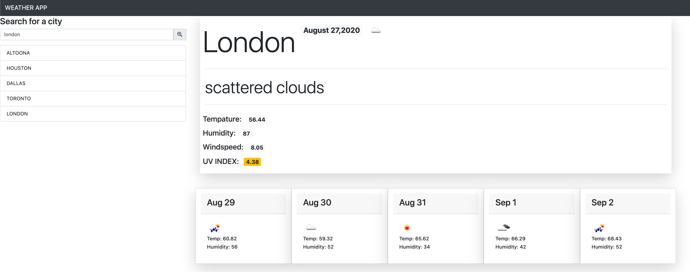

# hw6-weather_app
SITE is Located here: [Shane's weather app](https://trilambda122.github.io/hw6-weatherapp/)
#### BUGS
- [X] side bar list of cityies does not popule new cities after 5. this is because we are taking the first 5 elements in the array and not the last five. 
- [ ] Onclick listners work when pages loads, but stop working once a search has been done. when the sidebar is refesh and repopulated from a search it seems that the listen event is removed. 
### Functionality 
 - [X] Ability to search for a city
   - [X] current and future conditions
     - [X] ELEMENTS to RETURN
       - [X]  city name, [name]
       - [X]  the date,  [dt] will also need [timezone]
       - [X]  description, [weather[0].description]
       - [X]  coord lon and lat *will need these for future lookups* [coord.lat] [coord.lon]
       - [X]  an icon representation of weather conditions, [weather[0].icon]
       - [X]  the temperature, [main.temp]
       - [X]  the humidity, [main.humidity]
       - [X]  the wind speed, [wind.speed]
       - [X]  and the UV index *will need lat and long for city* [coord.lat,coord.lon] *will return* [value]
    - [ ]  Each element should be color coded 
       - [ ]   favorable, 
       - [ ]   moderate, 
       - [ ]   or severe
   - [X] save city to the a search history
     - [X] presented with current and future conditions for that city
   - [ ] Display 5 day forcast *will need lon,lag will return as an array for 7 days*
     - [X] displays the date, - [ ] [daily[0].dt]
     - [X] an icon representation of weather conditions, [daily[0].weather[0].icon] 
     - [X] the temperature, [daily[0].temp.day]
     - [X] and the humidity [daily[0].humidity]
   - [ ] on open
     - [ ] present last searched city forecast

*use moment.js for current date and time formating*
---


**UV SCALE**

| Range | Color  | Description | BootStrap Class       |
|-------|--------|-------------|-----------------------|
| 0-2   | Green  | Low         | badge badge-success   |
| 3-5   | Yellow | Moderate    | badge badge-warning   |
| 6-7   | Orange | High        | badge badge-secondary | *over written in CSS for background orangered
| 8-10  | Red    | Very High   | badge badge-danger    |
| 11+   | Violet | Extreme     | badge badge-dark      | *over written in CSS for background purple

**LAYOUT**
Inital rough of layout


Screen shot of final layout



**SELECTORS**
#city-search-text
#search-button
#city-location
#current-date
#current-temp
#current-humidity
#current-windspeed
#current-uv
#weather-icon
#side-bar-list
#weather-desc
#five-day-forcast-row


### API SECTION


**Current forcast by city URL**
> https://api.openweathermap.org/data/2.5/weather?q=${city}&units=imperial&appid=${API_KEY}


*q city name, state code and country code divided by comma, use ISO 3166 country codes. You can specify the parameter not only in English. In this case, the API response should be returned in the same language as the language of requested location name if the location is in our predefined list of more than 200,000 locations.*


**JSON RESULT**
```
{
    "base": "stations",
    "clouds": {
        "all": 4
    },
    "cod": 200,
    "coord": {
        "lat": 30.24,
        "lon": -97.77
    },
    "dt": 1598147864,
    "id": 0,
    "main": {
        "feels_like": 81.9,
        "humidity": 70,
        "pressure": 1009,
        "temp": 79.88,
        "temp_max": 82,
        "temp_min": 75.99
    },
    "name": "Austin",
    "sys": {
        "country": "US",
        "id": 2016722,
        "sunrise": 1598097764,
        "sunset": 1598144718,
        "type": 3
    },
    "timezone": -18000,
    "visibility": 10000,
    "weather": [
        {
            "description": "clear sky",
            "icon": "01n",
            "id": 800,
            "main": "Clear"
        }
    ],
    "wind": {
        "deg": 164,
        "speed": 9.26
    }
}

```


 **UV INDEX**
> https://api.openweathermap.org/data/2.5/uvi?lat=${lat}&lon=${lon}&appid=${API_KEY}

```
{
    "date": 1598184000,
    "date_iso": "2020-08-23T12:00:00Z",
    "lat": 30.27,
    "lon": -97.74,
    "value": 9.76
}
```


**USING ONE CALL for getting 5 day forcast by city URL**

> https://api.openweathermap.org/data/2.5/onecall?lat=${lat}&lon=${lon}&exclude=${exclude}
&appid=${API_KEY}

```
{
    "daily": [
        {
            "clouds": 1,
            "dew_point": 291.56,
            "dt": 1598205600,
            "feels_like": {
                "day": 305.37,
                "eve": 305.69,
                "morn": 305.01,
                "night": 302.11
            },
            "humidity": 46,
            "pop": 0,
            "pressure": 1016,
            "sunrise": 1598184189,
            "sunset": 1598231047,
            "temp": {
                "day": 304.57,
                "eve": 305.29,
                "max": 305.29,
                "min": 301.39,
                "morn": 302.33,
                "night": 301.39
            },
            "uvi": 10.71,
            "weather": [
                {
                    "description": "clear sky",
                    "icon": "01d",
                    "id": 800,
                    "main": "Clear"
                }
            ],
            "wind_deg": 67,
            "wind_speed": 3.09
        },
        {
            "clouds": 16,
            "dew_point": 289.47,
            "dt": 1598292000,
            "feels_like": {
                "day": 305.95,
                "eve": 308.45,
                "morn": 301.25,
                "night": 302.77
            },
            "humidity": 36,
            "pop": 0.07,
            "pressure": 1015,
            "sunrise": 1598270624,
            "sunset": 1598317381,
            "temp": {
                "day": 306.09,
                "eve": 308.1,
                "max": 308.1,
                "min": 299.42,
                "morn": 299.42,
                "night": 302.12
            },
            "uvi": 11.85,
            "weather": [
                {
                    "description": "few clouds",
                    "icon": "02d",
                    "id": 801,
                    "main": "Clouds"
                }
            ],
            "wind_deg": 69,
            "wind_speed": 2.96
        },
        {
            "clouds": 0,
            "dew_point": 287.71,
            "dt": 1598378400,
            "feels_like": {
                "day": 308.25,
                "eve": 306.88,
                "morn": 301.12,
                "night": 303.71
            },
            "humidity": 28,
            "pop": 0,
            "pressure": 1012,
            "sunrise": 1598357058,
            "sunset": 1598403714,
            "temp": {
                "day": 308.71,
                "eve": 307.89,
                "max": 310.38,
                "min": 300.5,
                "morn": 300.5,
                "night": 302.99
            },
            "uvi": 10.58,
            "weather": [
                {
                    "description": "clear sky",
                    "icon": "01d",
                    "id": 800,
                    "main": "Clear"
                }
            ],
            "wind_deg": 31,
            "wind_speed": 2.57
        },
        {
            "clouds": 9,
            "dew_point": 288.97,
            "dt": 1598464800,
            "feels_like": {
                "day": 309.19,
                "eve": 309.08,
                "morn": 303.97,
                "night": 305.17
            },
            "humidity": 29,
            "pop": 0.25,
            "pressure": 1009,
            "rain": 0.1,
            "sunrise": 1598443493,
            "sunset": 1598490046,
            "temp": {
                "day": 309.58,
                "eve": 310.15,
                "max": 311.36,
                "min": 301.54,
                "morn": 301.54,
                "night": 304.78
            },
            "uvi": 11.4,
            "weather": [
                {
                    "description": "light rain",
                    "icon": "10d",
                    "id": 500,
                    "main": "Rain"
                }
            ],
            "wind_deg": 28,
            "wind_speed": 3.13
        },
        {
            "clouds": 0,
            "dew_point": 291.49,
            "dt": 1598551200,
            "feels_like": {
                "day": 313.48,
                "eve": 308.77,
                "morn": 305.71,
                "night": 303.55
            },
            "humidity": 31,
            "pop": 0.55,
            "pressure": 1008,
            "rain": 0.28,
            "sunrise": 1598529927,
            "sunset": 1598576377,
            "temp": {
                "day": 311.34,
                "eve": 308.2,
                "max": 311.34,
                "min": 301.73,
                "morn": 301.73,
                "night": 302.61
            },
            "uvi": 10.18,
            "weather": [
                {
                    "description": "light rain",
                    "icon": "10d",
                    "id": 500,
                    "main": "Rain"
                }
            ],
            "wind_deg": 66,
            "wind_speed": 0.97
        },
        {
            "clouds": 0,
            "dew_point": 291.89,
            "dt": 1598637600,
            "feels_like": {
                "day": 311.1,
                "eve": 310.23,
                "morn": 302.39,
                "night": 302.43
            },
            "humidity": 33,
            "pop": 0.99,
            "pressure": 1010,
            "rain": 5.56,
            "sunrise": 1598616361,
            "sunset": 1598662708,
            "temp": {
                "day": 310.38,
                "eve": 307.85,
                "max": 310.38,
                "min": 300.69,
                "morn": 300.69,
                "night": 301.27
            },
            "uvi": 10.36,
            "weather": [
                {
                    "description": "moderate rain",
                    "icon": "10d",
                    "id": 501,
                    "main": "Rain"
                }
            ],
            "wind_deg": 185,
            "wind_speed": 3.1
        },
        {
            "clouds": 2,
            "dew_point": 292.31,
            "dt": 1598724000,
            "feels_like": {
                "day": 309.9,
                "eve": 308.71,
                "morn": 302.23,
                "night": 302.72
            },
            "humidity": 38,
            "pop": 0.31,
            "pressure": 1010,
            "sunrise": 1598702794,
            "sunset": 1598749038,
            "temp": {
                "day": 308.57,
                "eve": 309.68,
                "max": 311.26,
                "min": 299.36,
                "morn": 299.36,
                "night": 300.81
            },
            "uvi": 11.15,
            "weather": [
                {
                    "description": "clear sky",
                    "icon": "01d",
                    "id": 800,
                    "main": "Clear"
                }
            ],
            "wind_deg": 180,
            "wind_speed": 2.65
        },
        {
            "clouds": 75,
            "dew_point": 294.15,
            "dt": 1598810400,
            "feels_like": {
                "day": 304.87,
                "eve": 298.19,
                "morn": 302.29,
                "night": 301.64
            },
            "humidity": 53,
            "pop": 0.91,
            "pressure": 1008,
            "rain": 6.2,
            "sunrise": 1598789228,
            "sunset": 1598835368,
            "temp": {
                "day": 304.6,
                "eve": 298.52,
                "max": 304.6,
                "min": 298.52,
                "morn": 298.67,
                "night": 299.01
            },
            "uvi": 10.93,
            "weather": [
                {
                    "description": "moderate rain",
                    "icon": "10d",
                    "id": 501,
                    "main": "Rain"
                }
            ],
            "wind_deg": 96,
            "wind_speed": 5.37
        }
    ],
    "lat": 30.27,
    "lon": -97.74,
    "timezone": "America/Chicago",
    "timezone_offset": -18000
}
```